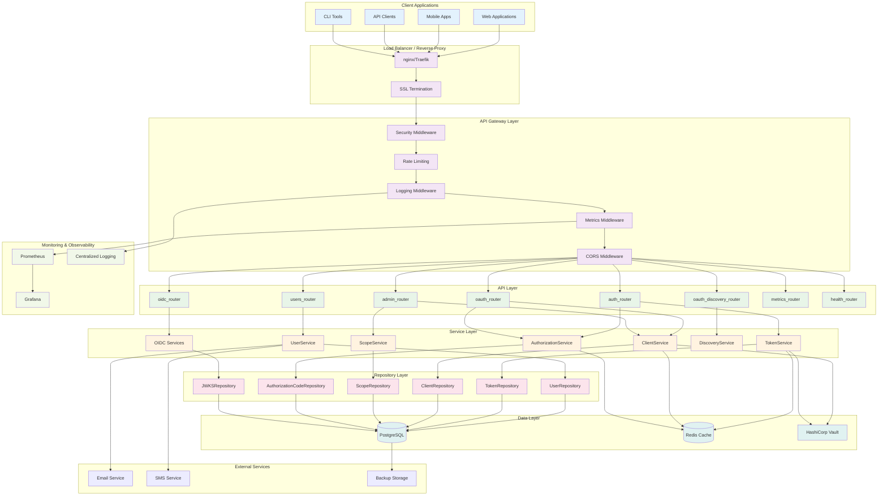
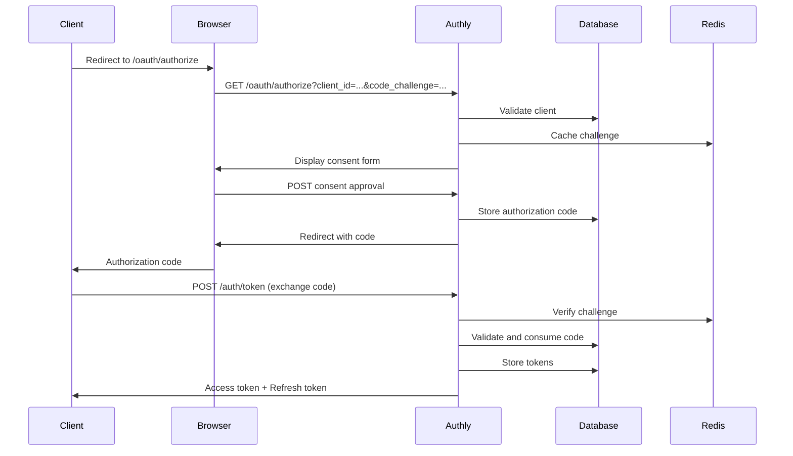
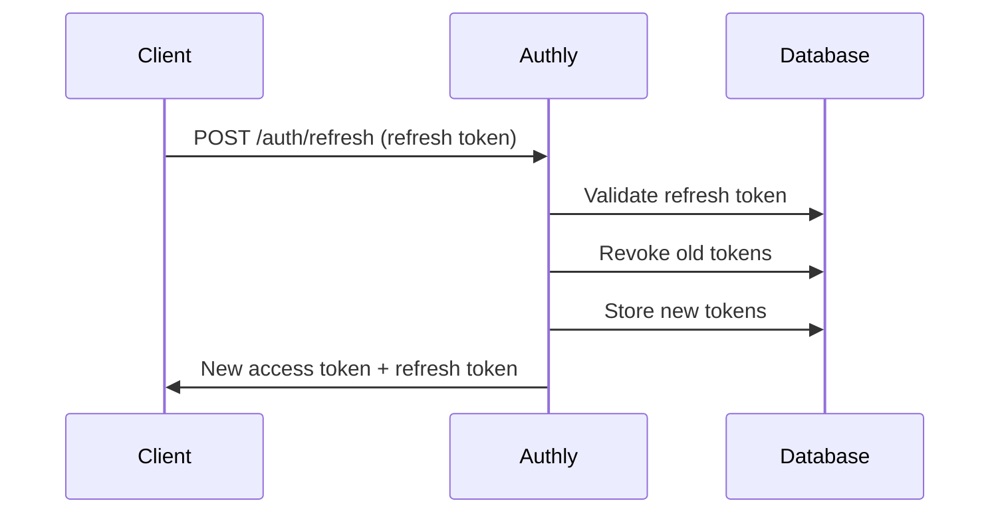
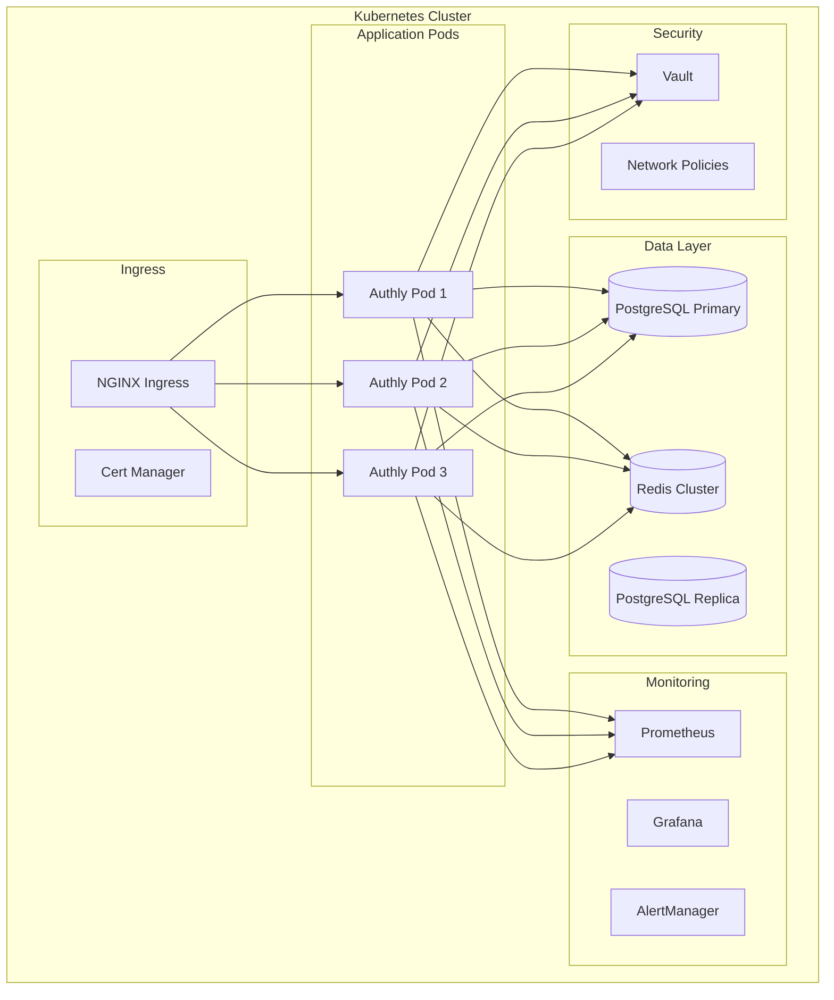

# Authly Architecture Documentation

This document describes the comprehensive architecture of Authly OAuth 2.1 Authorization Server, verified against the current codebase implementation.

## Related Documentation

- **[Service Architecture Patterns](./architecture/service-patterns.md)** - Detailed guide on service layer design, dependency injection, and repository patterns
- **[Quick Reference Guide](./architecture/QUICK-REFERENCE.md)** - Developer quick reference for common patterns and pitfalls

## Table of Contents

1. [Architecture Overview](#architecture-overview)
2. [System Architecture Diagram](#system-architecture-diagram)
3. [Component Layers](#component-layers)
4. [Data Flow](#data-flow)
5. [Security Architecture](#security-architecture)
6. [Deployment Architecture](#deployment-architecture)

## Architecture Overview

Authly is a production-ready OAuth 2.1 authorization server built with FastAPI, implementing enterprise-grade security, monitoring, and compliance features. The architecture follows a layered approach with clear separation of concerns:

### Key Features
- **OAuth 2.1 Compliance**: Full RFC implementation with PKCE, client authentication, token revocation
- **OpenID Connect 1.0**: Complete OIDC implementation with ID tokens and discovery
- **Enterprise Security**: Comprehensive security middleware, rate limiting, audit logging
- **Monitoring & Observability**: Prometheus metrics, structured logging, health checks
- **GDPR Compliance**: Privacy-by-design with data protection and user rights
- **High Availability**: Redis integration, graceful shutdown, circuit breakers

### Quality Metrics
- **Test Coverage**: 171/171 tests passing (100% success rate)
- **Standards Compliance**: OAuth 2.1, OIDC 1.0, RFC 7009, RFC 8414, GDPR
- **Production Ready**: Container orchestration, monitoring, security hardening

## System Architecture Diagram

## Component Layers

### 1. API Layer

The API layer handles HTTP requests and implements the OAuth 2.1 and OpenID Connect endpoints.

#### Core Routers
- **`auth_router.py`**: Authentication endpoints
  - `/auth/token` - OAuth 2.1 token endpoint (password, authorization_code, refresh_token grants)
  - `/auth/refresh` - Token refresh endpoint
  - `/auth/logout` - Session termination
  - `/auth/revoke` - Token revocation (RFC 7009)

- **`oauth_router.py`**: OAuth 2.1 authorization endpoints
  - `/oauth/authorize` - Authorization endpoint with PKCE
  - `/oauth/consent` - User consent management
  - `/oauth/clients` - Client registration and management

- **`oidc_router.py`**: OpenID Connect endpoints
  - `/oidc/userinfo` - User information endpoint
  - `/oidc/jwks` - JSON Web Key Set endpoint
  - `/oidc/logout` - OIDC logout flows

- **`oauth_discovery_router.py`**: RFC 8414 server metadata
  - `/.well-known/oauth-authorization-server` - OAuth server discovery
  - `/.well-known/openid_configuration` - OIDC discovery

#### Administrative Interfaces
- **`admin_router.py`**: Administrative API
  - Client management
  - Scope administration  
  - User management
  - System configuration

- **`users_router.py`**: User management API
  - User registration and profile management
  - Password changes and account verification
  - Privacy controls (GDPR)

#### Infrastructure Routers
- **`metrics_router.py`**: Prometheus metrics endpoint
- **`health_router.py`**: Health checks and readiness probes

#### Middleware Stack
- **`security_middleware.py`**: Security headers (HSTS, CSP, etc.)
- **`rate_limiter.py`**: Rate limiting and DDoS protection
- **`logging_middleware.py`**: Structured logging with correlation IDs
- **`metrics_middleware.py`**: Request metrics collection
- **`admin_middleware.py`**: Administrative access controls

### 2. Service Layer

Business logic layer implementing OAuth 2.1 and OIDC protocols.

#### Core Services
- **`AuthorizationService`**: OAuth 2.1 authorization flows
  - Authorization code generation with PKCE
  - Code challenge validation
  - Scope validation and consent

- **`TokenService`**: JWT token lifecycle management
  - Access token generation and validation
  - Refresh token rotation
  - Token revocation and cleanup
  - ID token generation (OIDC)

- **`ClientService`**: OAuth client management
  - Client registration and authentication
  - Confidential vs public client handling
  - Client credentials validation

- **`UserService`**: User lifecycle management
  - User registration and verification
  - Profile management
  - Authentication and authorization

- **`ScopeService`**: OAuth scope management
  - Scope validation and enforcement
  - Default scope assignment
  - Granular permission control

#### Discovery and OIDC Services
- **`DiscoveryService`**: RFC 8414 metadata
  - Server capability advertisement
  - Endpoint discovery
  - Supported features enumeration

- **OIDC Services**: OpenID Connect implementation
  - `id_token.py`: ID token generation and validation
  - `userinfo.py`: User information endpoint
  - `jwks.py`: Key management and rotation
  - `discovery.py`: OIDC discovery metadata

### 3. Repository Layer

Data access layer with PostgreSQL integration using psycopg-toolkit.

#### Core Repositories
- **`UserRepository`**: User data management
- **`TokenRepository`**: Token storage and retrieval
- **`ClientRepository`**: OAuth client persistence
- **`ScopeRepository`**: Scope definitions and assignments
- **`AuthorizationCodeRepository`**: Authorization code lifecycle
- **`JWKSRepository`**: JSON Web Key Set management

#### Features
- **Transaction Management**: Atomic operations with rollback
- **Connection Pooling**: Efficient database connection management
- **Query Optimization**: Indexed queries and caching
- **Database Migrations**: Schema versioning with Alembic

### 4. Configuration Layer

Secure configuration management with multiple backends.

#### Configuration Components
- **`AuthlyConfig`**: Core application configuration
- **`SecretProvider`**: Pluggable secret management
  - Environment variables
  - File-based secrets
  - HashiCorp Vault integration
  - AWS Secrets Manager (planned)
  - Azure Key Vault (planned)

#### Database Providers
- **PostgreSQL**: Primary production database
- **Redis**: Optional caching and session storage
- **In-memory**: Development and testing

### 5. Security Architecture

#### Authentication Security
- **Password Hashing**: bcrypt with configurable work factor
- **Token Security**: Signed JWTs with rotation
- **Session Management**: Secure session handling
- **Rate Limiting**: Per-endpoint and per-user limits

#### Authorization Security
- **OAuth 2.1**: Full specification compliance
- **PKCE**: Mandatory for authorization code flow
- **Scope Validation**: Granular permission control
- **Client Authentication**: Multiple authentication methods

#### Infrastructure Security
- **Security Headers**: HSTS, CSP, X-Frame-Options
- **CORS**: Configurable cross-origin policies
- **Input Validation**: Comprehensive request validation
- **Audit Logging**: Security event tracking

### 6. Monitoring and Observability

#### Metrics Collection
- **Prometheus Integration**: Comprehensive metrics
  - HTTP request metrics
  - OAuth business metrics
  - Database performance
  - Authentication metrics
  - Security events

#### Logging
- **Structured Logging**: JSON format with correlation IDs
- **Log Levels**: Configurable verbosity
- **Security Logging**: Audit trail for compliance
- **Performance Logging**: Request timing and diagnostics

#### Health Monitoring
- **Health Checks**: Database, Redis, external services
- **Readiness Probes**: Kubernetes integration
- **Graceful Shutdown**: Clean resource cleanup

## Data Flow

### OAuth 2.1 Authorization Code Flow

### Token Refresh Flow

## Security Architecture

### Defense in Depth

1. **Network Security**
   - TLS 1.2+ encryption
   - Security headers
   - CORS policies

2. **Authentication Security**
   - Multi-factor authentication support
   - Password policies
   - Account lockout protection

3. **Authorization Security**
   - OAuth 2.1 compliance
   - Scope-based permissions
   - PKCE for public clients

4. **Data Security**
   - Encryption at rest
   - Secure token storage
   - PII protection

5. **Operational Security**
   - Audit logging
   - Security monitoring
   - Incident response

### Threat Model

#### Mitigated Threats
- **Authorization Code Interception**: PKCE mandatory
- **Token Replay**: Short-lived tokens with rotation
- **Client Impersonation**: Client authentication
- **Brute Force**: Rate limiting and account lockout
- **Session Hijacking**: Secure session management
- **Data Breaches**: Encryption and access controls

## Deployment Architecture

### Container Orchestration

### Scalability Considerations

#### Horizontal Scaling
- **Stateless Design**: No server-side sessions
- **Database Scaling**: Read replicas and connection pooling
- **Cache Layer**: Redis for distributed caching
- **Load Balancing**: Multiple pod instances

#### Performance Optimization
- **Connection Pooling**: Efficient database connections
- **Query Optimization**: Indexed database queries
- **Caching Strategy**: Redis for frequently accessed data
- **CDN Integration**: Static asset delivery

### High Availability

#### Availability Targets
- **99.9% Uptime**: Production SLA
- **RTO**: 15 minutes recovery time
- **RPO**: 5 minutes data loss tolerance

#### Redundancy
- **Multi-AZ Deployment**: Database and application redundancy
- **Backup Strategy**: Automated backups with point-in-time recovery
- **Disaster Recovery**: Cross-region replication
- **Health Monitoring**: Automated failover

## Technology Stack

### Core Technologies
- **FastAPI**: Modern Python web framework
- **PostgreSQL**: Primary database with psycopg-toolkit
- **Redis**: Caching and session storage
- **JWT**: Secure token implementation
- **bcrypt**: Password hashing

### Infrastructure
- **Docker**: Containerization
- **Kubernetes**: Container orchestration
- **Prometheus**: Metrics collection
- **Grafana**: Monitoring dashboards
- **HashiCorp Vault**: Secret management

### Development
- **Python 3.11+**: Modern Python features
- **pytest**: Comprehensive testing framework
- **Alembic**: Database migrations
- **pre-commit**: Code quality enforcement
- **testcontainers**: Integration testing

## Conclusion

Authly's architecture provides a robust, secure, and scalable OAuth 2.1 authorization server suitable for enterprise production environments. The layered design ensures maintainability, while comprehensive monitoring and security features provide operational excellence.

Key architectural principles:
- **Security by Design**: Security considerations in every layer
- **Scalability**: Horizontal scaling capabilities
- **Observability**: Comprehensive monitoring and logging
- **Compliance**: GDPR and industry standards adherence
- **Maintainability**: Clear separation of concerns and clean code practices