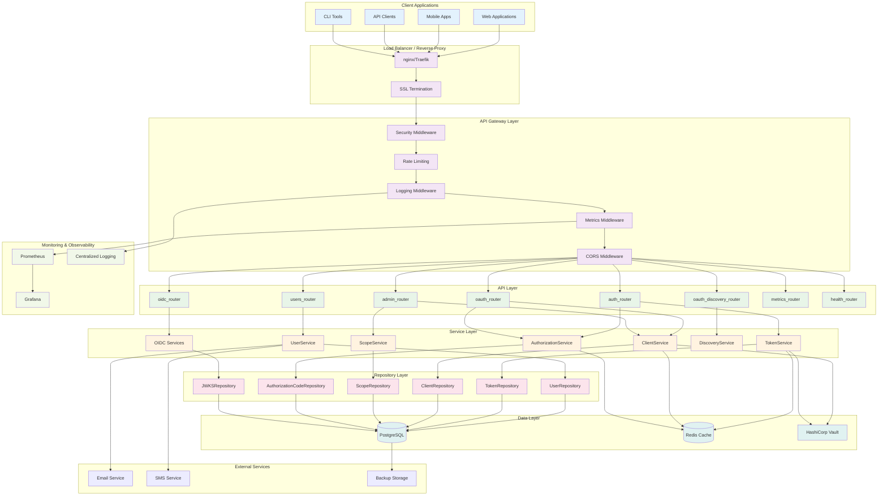
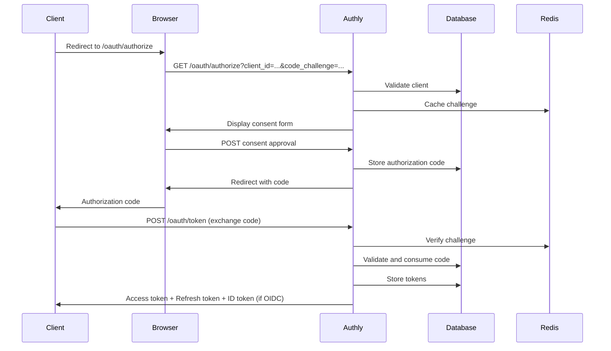
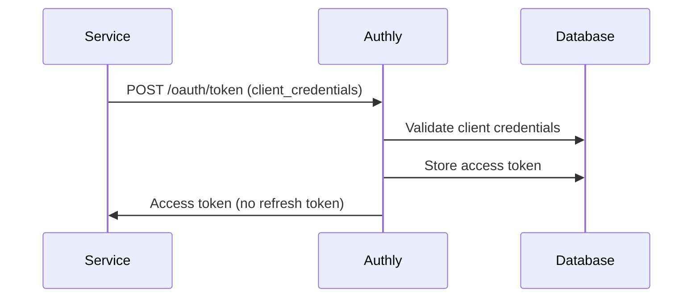
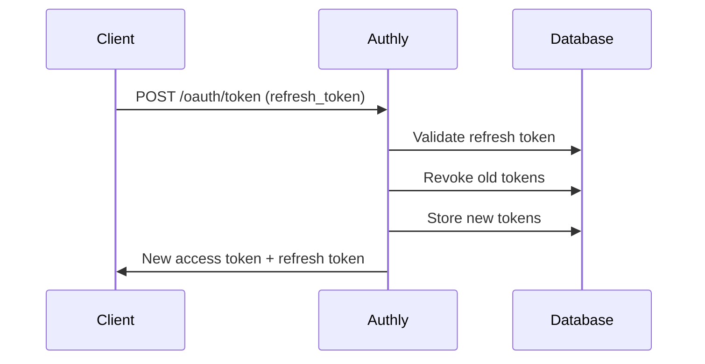
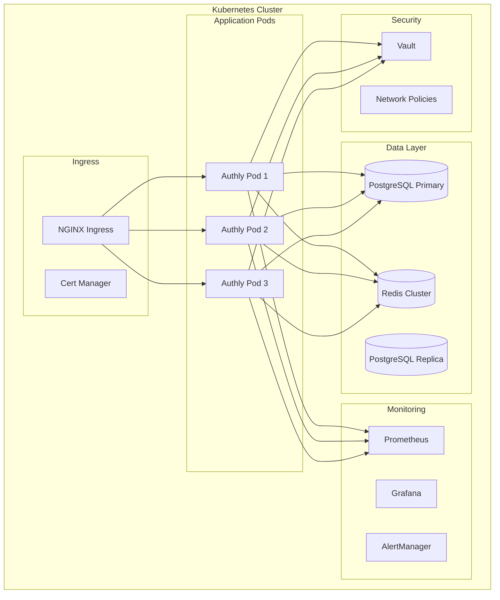

# Authly Architecture Documentation

This document describes the comprehensive architecture of Authly OAuth 2.1 Authorization Server, verified against the current codebase implementation.

## Table of Contents

1. [Architecture Overview](#architecture-overview)
2. [System Architecture Diagram](#system-architecture-diagram)
3. [Component Layers](#component-layers)
4. [Service Architecture Patterns](#service-architecture-patterns)
5. [Repository Patterns](#repository-patterns)
6. [Dependency Injection](#dependency-injection)
7. [Transaction Management](#transaction-management)
8. [Data Flow](#data-flow)
9. [Security Architecture](#security-architecture)
10. [Deployment Architecture](#deployment-architecture)
11. [Quick Reference Guide](#quick-reference-guide)

## Architecture Overview

Authly is a production-ready OAuth 2.1 authorization server built with FastAPI, implementing enterprise-grade security, monitoring, and compliance features. The architecture follows a layered approach with clear separation of concerns:

### Key Features
- **OAuth 2.1 Compliance**: Full RFC implementation with PKCE, client authentication, token revocation
- **OpenID Connect 1.0**: Complete OIDC implementation with ID tokens and discovery
- **Enterprise Security**: Comprehensive security middleware, rate limiting, audit logging
- **Monitoring & Observability**: Prometheus metrics, structured logging, health checks
- **GDPR Compliance**: Privacy-by-design with data protection and user rights
- **High Availability**: Redis integration, graceful shutdown, circuit breakers

### Quality Metrics
- **Test Coverage**: 416+ tests passing (100% success rate)
- **Standards Compliance**: OAuth 2.1, OIDC 1.0, RFC 7009, RFC 8414, GDPR
- **Production Ready**: Container orchestration, monitoring, security hardening

## System Architecture Diagram



## Component Layers

### Architecture Layer Diagram

```
┌─────────────────────────────────────────────────────┐
│                   API Layer (Routers)                │
│  - FastAPI routers handle HTTP requests             │
│  - Dependency injection for services                │
│  - Request/response validation                      │
└─────────────────────────────────────────────────────┘
                           │
                           ▼
┌─────────────────────────────────────────────────────┐
│                  Service Layer                       │
│  - Business logic and orchestration                 │
│  - Transaction management                           │
│  - Cross-repository operations                      │
└─────────────────────────────────────────────────────┘
                           │
                           ▼
┌─────────────────────────────────────────────────────┐
│                 Repository Layer                     │
│  - Data access and persistence                      │
│  - SQL query construction                           │
│  - Database transaction handling                    │
└─────────────────────────────────────────────────────┘
                           │
                           ▼
┌─────────────────────────────────────────────────────┐
│                    Database                          │
│  - PostgreSQL with async support                    │
│  - Connection pooling via psycopg                   │
└─────────────────────────────────────────────────────┘
```

### 1. API Layer

The API layer handles HTTP requests and implements the OAuth 2.1 and OpenID Connect endpoints.

#### Core Routers
- **`oauth_router.py`**: OAuth 2.1 authorization endpoints
  - `/api/v1/oauth/authorize` - Authorization endpoint with PKCE
  - `/api/v1/oauth/token` - Token endpoint (authorization_code, refresh_token, client_credentials)
  - `/api/v1/oauth/revoke` - Token revocation (RFC 7009)
  - `/api/v1/oauth/introspect` - Token introspection

- **`oidc_router.py`**: OpenID Connect endpoints
  - `/oidc/userinfo` - User information endpoint (GET and PUT)
  - `/oidc/logout` - OIDC logout flows
  - `/oidc/session/check` - Session status check

- **`oauth_discovery_router.py`**: RFC 8414 server metadata
  - `/.well-known/oauth-authorization-server` - OAuth server discovery
  - `/.well-known/openid-configuration` - OIDC discovery
  - `/.well-known/jwks.json` - JSON Web Key Set

#### Administrative Interfaces
- **`admin_router.py`**: Administrative API
  - Client management
  - Scope administration  
  - User management
  - System configuration

- **`users_router.py`**: User management API
  - User registration and profile management
  - Password changes and account verification
  - Privacy controls (GDPR)

#### Infrastructure Routers
- **`metrics_router.py`**: Prometheus metrics endpoint
- **`health_router.py`**: Health checks and readiness probes

#### Middleware Stack
- **`security_middleware.py`**: Security headers (HSTS, CSP, etc.)
- **`rate_limiter.py`**: Rate limiting and DDoS protection
- **`logging_middleware.py`**: Structured logging with correlation IDs
- **`metrics_middleware.py`**: Request metrics collection
- **`admin_middleware.py`**: Administrative access controls

### 2. Service Layer

Business logic layer implementing OAuth 2.1 and OIDC protocols.

#### Core Services
- **`AuthorizationService`**: OAuth 2.1 authorization flows
  - Authorization code generation with PKCE
  - Code challenge validation
  - Scope validation and consent

- **`TokenService`**: JWT token lifecycle management
  - Access token generation and validation
  - Refresh token rotation
  - Token revocation and cleanup
  - ID token generation (OIDC)
  - Client credentials tokens (M2M)

- **`ClientService`**: OAuth client management
  - Client registration and authentication
  - Confidential vs public client handling
  - Client credentials validation

- **`UserService`**: User lifecycle management
  - User registration and verification
  - Profile management
  - Authentication and authorization

- **`ScopeService`**: OAuth scope management
  - Scope validation and enforcement
  - Default scope assignment
  - Granular permission control

#### Discovery and OIDC Services
- **`DiscoveryService`**: RFC 8414 metadata
  - Server capability advertisement
  - Endpoint discovery
  - Supported features enumeration

- **OIDC Services**: OpenID Connect implementation
  - `id_token.py`: ID token generation and validation
  - `userinfo.py`: User information endpoint
  - `jwks.py`: Key management and rotation
  - `discovery.py`: OIDC discovery metadata

### 3. Repository Layer

Data access layer with PostgreSQL integration using psycopg-toolkit.

#### Core Repositories
- **`UserRepository`**: User data management
- **`TokenRepository`**: Token storage and retrieval
- **`ClientRepository`**: OAuth client persistence
- **`ScopeRepository`**: Scope definitions and assignments
- **`AuthorizationCodeRepository`**: Authorization code lifecycle
- **`JWKSRepository`**: JSON Web Key Set management

#### Features
- **Transaction Management**: Atomic operations with rollback
- **Connection Pooling**: Efficient database connection management
- **Query Optimization**: Indexed queries and caching
- **Database Migrations**: Schema versioning with Alembic

### 4. Configuration Layer

Secure configuration management with multiple backends.

#### Configuration Components
- **`AuthlyConfig`**: Core application configuration
- **`SecretProvider`**: Pluggable secret management
  - Environment variables
  - File-based secrets
  - HashiCorp Vault integration
  - AWS Secrets Manager (planned)
  - Azure Key Vault (planned)

#### Database Providers
- **PostgreSQL**: Primary production database
- **Redis**: Optional caching and session storage
- **In-memory**: Development and testing

## Service Architecture Patterns

### Service Responsibilities

Services encapsulate business logic and orchestrate operations across repositories:

```python
class ClientService:
    """
    Service layer for OAuth 2.1 client management business logic.
    
    Responsibilities:
    - Business rule validation
    - Cross-repository operations
    - Secret generation and hashing
    - Scope assignment and validation
    """
    
    def __init__(self, client_repo: ClientRepository, scope_repo: ScopeRepository, config: AuthlyConfig):
        self._client_repo = client_repo  # Note: private attributes with underscore
        self._scope_repo = scope_repo
        self._config = config
    
    async def create_client(self, request: OAuthClientCreateRequest) -> OAuthClientCredentialsResponse:
        # Business logic: validate, generate secrets, assign scopes
        # Orchestrate across multiple repositories
        pass
```

### Service Attribute Naming Convention

**IMPORTANT**: Services use private attributes (with underscore prefix) for repositories:

- `ClientService`: `_client_repo`, `_scope_repo`
- `UserService`: `_repo`
- `ScopeService`: `_scope_repo`
- `TokenService`: `_repo`, `_client_repo`

This convention prevents accidental direct repository access from routers.

### Error Handling Pattern

#### Repository Layer
- Raise `RecordNotFoundError` for missing records
- Let database errors bubble up
- No business logic validation

#### Service Layer
- Validate business rules
- Raise `HTTPException` with appropriate status codes
- Log operations for audit trail
- Handle cross-cutting concerns (metrics, caching)

#### Router Layer
- Minimal logic - just request/response handling
- Rely on FastAPI's automatic validation
- Let service exceptions bubble up to error handlers

## Repository Patterns

### Standard Repositories (using BaseRepository)

Most repositories inherit from `psycopg-toolkit`'s `BaseRepository` class, which provides standard CRUD operations:

```python
from psycopg_toolkit import BaseRepository

class UserRepository(BaseRepository[UserModel]):
    """Standard repository using BaseRepository for CRUD operations."""
    
    table_name = "users"
    model_class = UserModel
    
    # Custom methods extend base CRUD operations
    async def find_by_username(self, username: str) -> UserModel | None:
        return await self.get_first({"username": username})
```

**Standard Repositories:**
- `UserRepository` - User CRUD operations
- `ClientRepository` - OAuth client management
- `ScopeRepository` - OAuth scope management
- `TokenRepository` - Token persistence
- `AuthorizationCodeRepository` - Authorization code management

### Special Case Repositories

Some repositories **DO NOT** inherit from `BaseRepository` because they handle specialized operations beyond standard CRUD:

```python
class JWKSRepository:
    """
    SPECIAL CASE: This repository does NOT inherit from BaseRepository because:
    - It manages cryptographic keys, not standard CRUD entities
    - Requires specialized operations like key rotation and cryptographic validation
    - Handles complex key lifecycle management
    """
    
    def __init__(self, conn: AsyncConnection):
        self._conn = conn
```

**Special Case Repositories:**
- `JWKSRepository` - Cryptographic key management, key rotation
- `SessionRepository` - Session state management, complex queries

## Dependency Injection

### Service Dependencies

All services are created through FastAPI's dependency injection system:

```python
# In admin_dependencies.py
async def get_admin_client_service(
    conn: AsyncConnection = Depends(get_database_connection),
    config: AuthlyConfig = Depends(get_config),
) -> ClientService:
    """
    Get ClientService instance for admin operations.
    
    Creates ClientService with required repositories and configuration,
    following the established service pattern.
    """
    client_repo = ClientRepository(conn)
    scope_repo = ScopeRepository(conn)
    return ClientService(client_repo, scope_repo, config)

# In router
@router.post("/clients")
async def create_client(
    request: OAuthClientCreateRequest,
    client_service: ClientService = Depends(get_admin_client_service),  # Injected
    _admin: UserModel = Depends(require_admin_client_write),
) -> OAuthClientCredentialsResponse:
    return await client_service.create_client(request)
```

### Dependency Files Organization

- `core/dependencies.py` - Core dependencies (database, config, resource manager)
- `api/admin_dependencies.py` - Admin-specific services and auth
- `api/oauth_dependencies.py` - OAuth flow dependencies
- `api/users_dependencies.py` - User management dependencies
- `api/auth_dependencies.py` - Authentication dependencies

## Transaction Management

### Transaction Isolation in Tests

**CRITICAL**: Never keep an open database transaction while making HTTP test server calls:

```python
# ❌ BROKEN - Transaction not visible to HTTP server
async def test_something(test_server, transaction_manager):
    async with transaction_manager.transaction() as conn:
        user = await create_user(conn)  
        response = await test_server.client.get(f"/users/{user.id}")
        # FAILS: User not found - data not committed!

# ✅ CORRECT - Use committed fixtures
async def test_something(test_server, committed_user):
    # committed_user is already committed to database
    response = await test_server.client.get(f"/users/{committed_user.id}")
    # SUCCESS: User is visible to HTTP server
```

### Service Transaction Patterns

Services should handle transactions internally when needed:

```python
class UserService:
    async def cascade_delete_user(self, user_id: UUID) -> dict:
        """Delete user with all related data in a transaction."""
        async with self._repo._conn.transaction():
            # All operations in same transaction
            tokens_deleted = await self._delete_user_tokens(user_id)
            codes_deleted = await self._delete_auth_codes(user_id)
            user_deleted = await self._repo.delete(user_id)
            # Commit happens automatically on context exit
        return {
            "tokens": tokens_deleted,
            "codes": codes_deleted,
            "user": user_deleted
        }
```

## Data Flow

### OAuth 2.1 Authorization Code Flow



### Client Credentials Flow (M2M)



### Token Refresh Flow



## Security Architecture

### Defense in Depth

1. **Network Security**
   - TLS 1.2+ encryption
   - Security headers
   - CORS policies

2. **Authentication Security**
   - Multi-factor authentication support
   - Password policies
   - Account lockout protection

3. **Authorization Security**
   - OAuth 2.1 compliance
   - Scope-based permissions
   - PKCE mandatory for authorization code flow

4. **Data Security**
   - Encryption at rest
   - Secure token storage
   - PII protection

5. **Operational Security**
   - Audit logging
   - Security monitoring
   - Incident response

### Threat Model

#### Mitigated Threats
- **Authorization Code Interception**: PKCE mandatory
- **Token Replay**: Short-lived tokens with rotation
- **Client Impersonation**: Client authentication
- **Brute Force**: Rate limiting and account lockout
- **Session Hijacking**: Secure session management
- **Data Breaches**: Encryption and access controls

## Deployment Architecture

### Container Orchestration



### Scalability Considerations

#### Horizontal Scaling
- **Stateless Design**: No server-side sessions
- **Database Scaling**: Read replicas and connection pooling
- **Cache Layer**: Redis for distributed caching
- **Load Balancing**: Multiple pod instances

#### Performance Optimization
- **Connection Pooling**: Efficient database connections
- **Query Optimization**: Indexed database queries
- **Caching Strategy**: Redis for frequently accessed data
- **CDN Integration**: Static asset delivery

### High Availability

#### Availability Targets
- **99.9% Uptime**: Production SLA
- **RTO**: 15 minutes recovery time
- **RPO**: 5 minutes data loss tolerance

#### Redundancy
- **Multi-AZ Deployment**: Database and application redundancy
- **Backup Strategy**: Automated backups with point-in-time recovery
- **Disaster Recovery**: Cross-region replication
- **Health Monitoring**: Automated failover

## Quick Reference Guide

### 🏗️ Architecture Layers

| Layer | Purpose | Location | Example |
|-------|---------|----------|---------|
| **Routers** | HTTP endpoints | `src/authly/api/*_router.py` | `admin_router.py` |
| **Services** | Business logic | `src/authly/*/service.py` | `ClientService` |
| **Repositories** | Data access | `src/authly/*/*_repository.py` | `UserRepository` |
| **Models** | Data structures | `src/authly/*/models.py` | `UserModel` |

### 🔌 Creating a Service Dependency

```python
# In api/admin_dependencies.py
async def get_admin_client_service(
    conn: AsyncConnection = Depends(get_database_connection),
    config: AuthlyConfig = Depends(get_config),
) -> ClientService:
    client_repo = ClientRepository(conn)
    scope_repo = ScopeRepository(conn)
    return ClientService(client_repo, scope_repo, config)
```

### 🎯 Service Attribute Names

| Service | Repository Attributes |
|---------|----------------------|
| `ClientService` | `_client_repo`, `_scope_repo` |
| `UserService` | `_repo` |
| `ScopeService` | `_scope_repo` |
| `TokenService` | `_repo`, `_client_repo` |

### 🧪 Testing Patterns

#### ❌ WRONG: Transaction + HTTP Call
```python
async def test_broken(test_server, transaction_manager):
    async with transaction_manager.transaction() as conn:
        user = await create_user(conn)  # Not committed!
        response = await test_server.client.get(f"/users/{user.id}")
        # FAILS: User not visible to HTTP server
```

#### ✅ CORRECT: Committed Fixtures
```python
async def test_working(test_server, committed_user):
    response = await test_server.client.get(f"/users/{committed_user.id}")
    # SUCCESS: User is committed and visible
```

### 📁 File Organization

```
src/authly/
├── api/
│   ├── admin_router.py         # Admin endpoints
│   ├── admin_dependencies.py   # Admin service DI
│   ├── oauth_router.py         # OAuth endpoints
│   └── oauth_dependencies.py   # OAuth service DI
├── oauth/
│   ├── client_service.py       # Business logic
│   ├── client_repository.py    # Data access
│   └── models.py               # Data models
└── users/
    ├── service.py              # Business logic
    ├── repository.py           # Data access
    └── models.py               # Data models
```

### 🚀 Common Tasks

#### Add a New Endpoint
1. Add method to service
2. Add endpoint to router with DI
3. Add tests with committed fixtures

#### Add a New Service
1. Create service class with `_repo` attributes
2. Add dependency function in `*_dependencies.py`
3. Use `Depends()` in router

#### Fix a Failing Test
1. Check for transaction isolation issues
2. Use committed fixtures for HTTP tests
3. Verify service uses correct attribute names

### ⚠️ Common Pitfalls

| Problem | Solution |
|---------|----------|
| `'ClientService' object has no attribute 'client_repo'` | Use `_client_repo` (with underscore) |
| Test fails with "not found" after creating in transaction | Use committed fixtures |
| Inline service creation in router | Move to dependency function |
| Business logic in repository | Move to service layer |
| Direct repository access from router | Use service layer |

## Best Practices

### DO:
- ✅ Use dependency injection for all services
- ✅ Keep repositories focused on data access
- ✅ Put business logic in services
- ✅ Use private attributes in services (`_repo`)
- ✅ Document special case repositories
- ✅ Use committed fixtures for HTTP tests
- ✅ Handle transactions at service level

### DON'T:
- ❌ Create repositories/services inline in routers
- ❌ Put business logic in repositories
- ❌ Access repositories directly from routers
- ❌ Mix transaction scopes with HTTP calls
- ❌ Use mocks for database testing
- ❌ Ignore error handling patterns

## Migration Guide

### Converting Inline Creation to DI

Before:
```python
@router.get("/clients")
async def list_clients(conn: AsyncConnection = Depends(get_database_connection)):
    client_repo = ClientRepository(conn)  # ❌ Inline creation
    return await client_repo.get_all()
```

After:
```python
@router.get("/clients")
async def list_clients(client_service: ClientService = Depends(get_client_service)):
    return await client_service.list_clients()  # ✅ Dependency injection
```

### Adding New Services

1. Create service class in appropriate module:
```python
# In authly/new_feature/service.py
class NewFeatureService:
    def __init__(self, repo: NewFeatureRepository, config: AuthlyConfig):
        self._repo = repo
        self._config = config
```

2. Add dependency function:
```python
# In api/dependencies.py
async def get_new_feature_service(
    conn: AsyncConnection = Depends(get_database_connection),
    config: AuthlyConfig = Depends(get_config),
) -> NewFeatureService:
    repo = NewFeatureRepository(conn)
    return NewFeatureService(repo, config)
```

3. Use in router:
```python
@router.post("/new-feature")
async def create_feature(
    request: NewFeatureRequest,
    service: NewFeatureService = Depends(get_new_feature_service),
):
    return await service.create(request)
```

## Technology Stack

### Core Technologies
- **FastAPI**: Modern Python web framework
- **PostgreSQL**: Primary database with psycopg-toolkit
- **Redis**: Caching and session storage
- **JWT**: Secure token implementation
- **bcrypt**: Password hashing

### Infrastructure
- **Docker**: Containerization
- **Kubernetes**: Container orchestration
- **Prometheus**: Metrics collection
- **Grafana**: Monitoring dashboards
- **HashiCorp Vault**: Secret management

### Development
- **Python 3.11+**: Modern Python features
- **pytest**: Comprehensive testing framework
- **Alembic**: Database migrations
- **pre-commit**: Code quality enforcement
- **testcontainers**: Integration testing

## Conclusion

Authly's architecture provides a robust, secure, and scalable OAuth 2.1 authorization server suitable for enterprise production environments. The layered design ensures maintainability, while comprehensive monitoring and security features provide operational excellence.

Key architectural principles:
- **Security by Design**: Security considerations in every layer
- **Scalability**: Horizontal scaling capabilities
- **Observability**: Comprehensive monitoring and logging
- **Compliance**: GDPR and industry standards adherence
- **Maintainability**: Clear separation of concerns and clean code practices

These patterns provide a consistent, testable, and maintainable architecture for the Authly service. Following these patterns ensures:

- Clear separation of concerns
- Consistent error handling
- Proper transaction management
- Testable code at all layers
- Maintainable and extensible architecture

When in doubt, follow the existing patterns in the codebase and refer to this documentation for guidance.