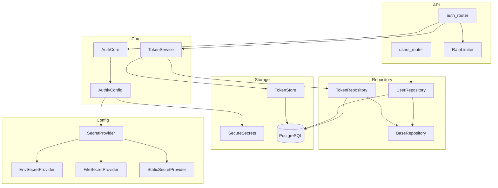

# Component Architecture

```mermaid
graph TB
    subgraph API
        AR[auth_router]
        UR[users_router]
        RL[RateLimiter]
    end

    subgraph Core
        AC[AuthlyConfig]
        TS[TokenService]
        Auth[AuthCore]
    end

    subgraph Repository
        UR2[UserRepository]
        TR[TokenRepository]
        BS[BaseRepository]
    end

    subgraph Storage
        SS[SecureSecrets]
        TS2[TokenStore]
        DB[(PostgreSQL)]
    end

    subgraph Config
        SP[SecretProvider]
        EnvSP[EnvSecretProvider]
        FileSP[FileSecretProvider]
        StaticSP[StaticSecretProvider]
    end

    AR --> TS
    AR --> Auth
    AR --> RL
    UR --> UR2
    TS --> TR
    TS --> TS2
    TS2 --> DB
    TR --> DB
    UR2 --> DB
    UR2 --> BS
    TR --> BS
    AC --> SS
    AC --> SP
    SP --> EnvSP
    SP --> FileSP
    SP --> StaticSP
    Auth --> AC
```