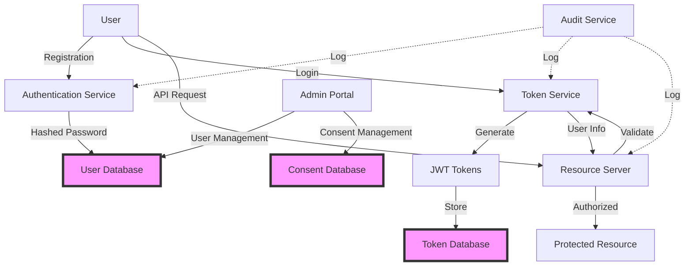

# GDPR Compliance Guide for Authly

This document provides a comprehensive analysis of GDPR compliance requirements for Authly OAuth 2.1 Authorization Server, including personal data processing analysis, privacy statement templates, and implementation guidelines.

## Table of Contents

1. [Executive Summary](#executive-summary)
2. [Personal Data Processing Analysis](#personal-data-processing-analysis)
3. [Legal Basis for Processing](#legal-basis-for-processing)
4. [Technical and Organizational Measures](#technical-and-organizational-measures)
5. [Data Subject Rights Implementation](#data-subject-rights-implementation)
6. [Privacy Statement Template](#privacy-statement-template)
7. [Data Protection Impact Assessment](#data-protection-impact-assessment)
8. [Compliance Checklist](#compliance-checklist)
9. [Implementation Roadmap](#implementation-roadmap)

## Executive Summary

Authly processes personal data as an OAuth 2.1 authorization server, acting as a **data processor** for organizations implementing authentication and authorization services. This guide ensures GDPR compliance through:

- **Minimal Data Collection**: Only essential authentication data
- **Purpose Limitation**: Data used solely for authentication/authorization
- **Security by Design**: Encryption, secure hashing, access controls
- **Transparency**: Clear privacy notices and consent mechanisms
- **User Rights**: Full support for access, rectification, erasure, and portability

## Personal Data Processing Analysis

### Data Categories Collected

#### 1. Authentication Data
```yaml
User Account Data:
  - Username: Required for identification
  - Email: Required for communication and recovery
  - Password Hash: Bcrypt-hashed, never stored in plain text
  - User ID: UUID for internal reference
  
Processing Details:
  - Purpose: User authentication
  - Retention: Until account deletion
  - Access: Limited to authentication service
  - Security: Bcrypt hashing, database encryption
```

#### 2. Authorization Data
```yaml
OAuth Tokens:
  - Access Tokens: JWT with user claims
  - Refresh Tokens: Secure random tokens
  - ID Tokens: OIDC identity assertions
  
Processing Details:
  - Purpose: API access authorization
  - Retention: Configurable expiration (15 min - 7 days)
  - Access: Token service only
  - Security: Signed JWTs, secure storage
```

#### 3. Profile Data
```yaml
User Profile:
  - Full Name: Optional, for display
  - Phone Number: Optional, for 2FA
  - Locale: Optional, for localization
  - Picture URL: Optional, for avatar
  
Processing Details:
  - Purpose: Enhanced user experience
  - Retention: Until explicitly updated/deleted
  - Access: Profile service, with user consent
  - Security: Encrypted at rest
```

#### 4. Activity Data
```yaml
Login Activity:
  - Last Login: Timestamp
  - Login IP: For security monitoring
  - Failed Attempts: Rate limiting
  - Active Sessions: Session management
  
Processing Details:
  - Purpose: Security and fraud prevention
  - Retention: 90 days (configurable)
  - Access: Security team only
  - Security: Encrypted logs, restricted access
```

#### 5. Consent Records
```yaml
Consent Data:
  - Consent Timestamp: When given
  - Consent Version: Policy version
  - Consent Scope: What was consented to
  - Withdrawal: If/when withdrawn
  
Processing Details:
  - Purpose: Legal compliance
  - Retention: 3 years after withdrawal
  - Access: Compliance team only
  - Security: Immutable audit log
```

### Data Flow Diagram



## Legal Basis for Processing

### 1. Contract Performance (Article 6(1)(b))
- **Authentication Services**: Processing necessary to provide login functionality
- **Authorization Services**: Token generation for API access
- **Account Management**: User profile maintenance

### 2. Legitimate Interests (Article 6(1)(f))
- **Security Monitoring**: Fraud prevention and abuse detection
- **Service Improvement**: Anonymous analytics and performance monitoring
- **Legal Compliance**: Audit trails for regulatory requirements

### 3. Consent (Article 6(1)(a))
- **Marketing Communications**: Optional newsletters
- **Enhanced Profile Data**: Additional optional fields
- **Third-Party Integrations**: Sharing with external services

### 4. Legal Obligation (Article 6(1)(c))
- **Data Retention**: Compliance with legal retention requirements
- **Law Enforcement**: Response to valid legal requests
- **Tax Records**: Financial transaction records

## Technical and Organizational Measures

### Security Measures

#### 1. Encryption
```python
# Data at Rest
DATABASE_ENCRYPTION = {
    "algorithm": "AES-256-GCM",
    "key_management": "AWS KMS / HashiCorp Vault",
    "scope": ["user_data", "tokens", "audit_logs"]
}

# Data in Transit
TLS_CONFIGURATION = {
    "minimum_version": "TLS 1.2",
    "cipher_suites": ["TLS_ECDHE_RSA_WITH_AES_256_GCM_SHA384"],
    "hsts": "max-age=31536000; includeSubDomains"
}

# Password Hashing
PASSWORD_HASHING = {
    "algorithm": "bcrypt",
    "work_factor": 12,
    "upgrade_path": "argon2id (planned)"
}
```

#### 2. Access Controls
```yaml
Role-Based Access Control:
  - User: Own data only
  - Admin: User management
  - Auditor: Read-only logs
  - System: Automated processes

Principle of Least Privilege:
  - Database: Application-specific credentials
  - API: Scope-based permissions
  - Admin: Time-limited sessions
  - Logs: Write-only for applications
```

#### 3. Monitoring and Logging
```python
SECURITY_MONITORING = {
    "failed_login_threshold": 5,
    "session_timeout": "30 minutes",
    "anomaly_detection": "enabled",
    "log_retention": "90 days",
    "log_encryption": "enabled"
}

AUDIT_EVENTS = [
    "user_registration",
    "user_login",
    "password_change",
    "profile_update",
    "consent_given",
    "consent_withdrawn",
    "data_export",
    "account_deletion"
]
```

### Organizational Measures

#### 1. Data Protection Officer (DPO)
- Appointed DPO with direct reporting to management
- Regular privacy impact assessments
- Employee training programs
- Incident response procedures

#### 2. Privacy by Design
- Minimal data collection by default
- Automatic data expiration
- Pseudonymization where possible
- Regular security audits

#### 3. Vendor Management
- Data Processing Agreements (DPA) with all vendors
- Regular vendor security assessments
- Subprocessor transparency
- Cross-border transfer safeguards

## Data Subject Rights Implementation

### 1. Right to Access (Article 15)

```python
@router.get("/api/v1/users/{user_id}/data-export")
async def export_user_data(
    user_id: UUID,
    current_user: UserModel = Depends(get_current_user),
    user_repo: UserRepository = Depends(get_user_repository),
    token_repo: TokenRepository = Depends(get_token_repository)
):
    """Export all user data in machine-readable format"""
    
    # Verify user can only access their own data
    if str(current_user.id) != str(user_id):
        raise HTTPException(status_code=403, detail="Access denied")
    
    # Collect all user data
    user_data = {
        "account_information": {
            "user_id": str(user_id),
            "username": current_user.username,
            "email": current_user.email,
            "created_at": current_user.created_at.isoformat(),
            "last_login": current_user.last_login.isoformat() if current_user.last_login else None,
            "is_active": current_user.is_active,
            "is_verified": current_user.is_verified
        },
        "profile_data": {
            "full_name": current_user.full_name,
            "phone_number": current_user.phone_number,
            "locale": current_user.locale,
            "picture": current_user.picture
        },
        "authentication_data": {
            "active_sessions": await token_repo.get_user_tokens(user_id),
            "login_history": await get_login_history(user_id),
            "connected_applications": await get_authorized_clients(user_id)
        },
        "consent_records": await get_consent_records(user_id),
        "data_processing_purposes": [
            "Authentication and authorization",
            "Security and fraud prevention",
            "Service improvement",
            "Legal compliance"
        ]
    }
    
    # Generate downloadable JSON file
    return JSONResponse(
        content=user_data,
        headers={
            "Content-Disposition": f"attachment; filename=user_data_{user_id}.json"
        }
    )
```

### 2. Right to Rectification (Article 16)

```python
@router.patch("/api/v1/users/{user_id}")
async def update_user_data(
    user_id: UUID,
    update_data: UserUpdateRequest,
    current_user: UserModel = Depends(get_current_user),
    user_repo: UserRepository = Depends(get_user_repository)
):
    """Allow users to update their personal data"""
    
    # Verify user can only update their own data
    if str(current_user.id) != str(user_id):
        raise HTTPException(status_code=403, detail="Access denied")
    
    # Validate and sanitize input
    allowed_fields = ["full_name", "phone_number", "locale", "picture"]
    update_dict = {
        k: v for k, v in update_data.dict(exclude_unset=True).items() 
        if k in allowed_fields
    }
    
    # Update user data
    updated_user = await user_repo.update(user_id, update_dict)
    
    # Log the update for audit trail
    await audit_log.record({
        "event": "user_data_rectification",
        "user_id": str(user_id),
        "updated_fields": list(update_dict.keys()),
        "timestamp": datetime.utcnow()
    })
    
    return updated_user
```

### 3. Right to Erasure (Article 17)

```python
@router.delete("/api/v1/users/{user_id}")
async def delete_user_account(
    user_id: UUID,
    confirmation: DeleteAccountRequest,
    current_user: UserModel = Depends(get_current_user),
    user_repo: UserRepository = Depends(get_user_repository),
    token_repo: TokenRepository = Depends(get_token_repository)
):
    """Implement right to be forgotten"""
    
    # Verify user can only delete their own account
    if str(current_user.id) != str(user_id):
        raise HTTPException(status_code=403, detail="Access denied")
    
    # Verify deletion confirmation
    if not confirmation.confirmed or confirmation.reason not in VALID_DELETION_REASONS:
        raise HTTPException(status_code=400, detail="Invalid deletion request")
    
    # Check for legal retention obligations
    retention_check = await check_retention_obligations(user_id)
    if retention_check.must_retain:
        return {
            "status": "partial_deletion",
            "message": "Some data must be retained for legal compliance",
            "retained_data": retention_check.retained_categories,
            "retention_until": retention_check.retention_end_date
        }
    
    # Perform cascading deletion
    deletion_result = await perform_user_deletion(user_id, {
        "delete_tokens": True,
        "delete_consents": True,
        "delete_audit_logs": False,  # Keep for legal compliance
        "anonymize_logs": True,      # Replace user_id with hash
        "notify_connected_services": True
    })
    
    # Send confirmation email
    await send_deletion_confirmation(current_user.email)
    
    return {
        "status": "deleted",
        "deletion_id": deletion_result.id,
        "completed_at": deletion_result.timestamp
    }
```

### 4. Right to Data Portability (Article 20)

```python
@router.post("/api/v1/users/{user_id}/data-portability")
async def request_data_portability(
    user_id: UUID,
    format: DataPortabilityFormat,
    current_user: UserModel = Depends(get_current_user)
):
    """Export data in standard, machine-readable format"""
    
    # Verify user identity
    if str(current_user.id) != str(user_id):
        raise HTTPException(status_code=403, detail="Access denied")
    
    # Prepare data in requested format
    if format == DataPortabilityFormat.JSON:
        data = await prepare_json_export(user_id)
        media_type = "application/json"
        file_extension = "json"
    elif format == DataPortabilityFormat.CSV:
        data = await prepare_csv_export(user_id)
        media_type = "text/csv"
        file_extension = "csv"
    else:
        raise HTTPException(status_code=400, detail="Unsupported format")
    
    # Include standardized schema documentation
    data["_schema"] = {
        "version": "1.0",
        "format": "OAuth 2.0 User Data Export",
        "specification": "https://dataportability.org/schemas/oauth2"
    }
    
    return Response(
        content=data,
        media_type=media_type,
        headers={
            "Content-Disposition": f"attachment; filename=user_data_{user_id}.{file_extension}"
        }
    )
```

### 5. Right to Restriction (Article 18)

```python
@router.post("/api/v1/users/{user_id}/restrict-processing")
async def restrict_data_processing(
    user_id: UUID,
    restriction: ProcessingRestrictionRequest,
    current_user: UserModel = Depends(get_current_user)
):
    """Restrict processing of user data"""
    
    # Implement processing restrictions
    restrictions = await apply_processing_restrictions(user_id, {
        "restrict_marketing": restriction.restrict_marketing,
        "restrict_profiling": restriction.restrict_profiling,
        "restrict_automated_decisions": restriction.restrict_automated_decisions,
        "allow_essential_only": restriction.essential_only
    })
    
    return {
        "status": "restricted",
        "restrictions": restrictions,
        "effective_date": datetime.utcnow()
    }
```

## Privacy Statement Template

```markdown
# Privacy Statement for [Organization Name]

**Last Updated**: [Date]
**Version**: 1.0

## 1. Introduction

[Organization Name] ("we", "our", or "us") operates an OAuth 2.1 authorization service powered by Authly. This Privacy Statement explains how we collect, use, disclose, and safeguard your personal data in compliance with the General Data Protection Regulation (GDPR) and other applicable privacy laws.

## 2. Data Controller Information

**Data Controller**: [Organization Name]
**Address**: [Organization Address]
**Email**: privacy@[organization.com]
**Data Protection Officer**: [DPO Name] - dpo@[organization.com]

## 3. Personal Data We Collect

### 3.1 Account Information
- **Data**: Username, email address, hashed password
- **Purpose**: User authentication and account management
- **Legal Basis**: Contract performance
- **Retention**: Until account deletion

### 3.2 Profile Information (Optional)
- **Data**: Full name, phone number, profile picture, locale
- **Purpose**: Enhanced user experience, two-factor authentication
- **Legal Basis**: Consent
- **Retention**: Until removed by user

### 3.3 Authentication Data
- **Data**: OAuth tokens, session information, login timestamps
- **Purpose**: Secure access to services
- **Legal Basis**: Contract performance
- **Retention**: Token expiration + 30 days

### 3.4 Security Data
- **Data**: IP addresses, device information, login attempts
- **Purpose**: Security monitoring and fraud prevention
- **Legal Basis**: Legitimate interests
- **Retention**: 90 days

## 4. How We Use Your Data

We process your personal data for the following purposes:

1. **Authentication Services**: To verify your identity and provide secure access
2. **Authorization Management**: To manage permissions and access controls
3. **Security**: To prevent fraud, abuse, and unauthorized access
4. **Communication**: To send service-related notifications
5. **Legal Compliance**: To comply with legal obligations
6. **Service Improvement**: To analyze and improve our services (anonymized data)

## 5. Data Sharing and Transfers

### 5.1 Third-Party Services
We may share data with:
- **Infrastructure Providers**: AWS/Azure/GCP (with appropriate safeguards)
- **Security Services**: For threat detection and prevention
- **Legal Authorities**: When required by law

### 5.2 International Transfers
When we transfer data outside the EEA, we ensure appropriate safeguards:
- Standard Contractual Clauses (SCCs)
- Adequacy decisions
- Your explicit consent

## 6. Your Rights

Under GDPR, you have the following rights:

1. **Access**: Request a copy of your personal data
2. **Rectification**: Correct inaccurate or incomplete data
3. **Erasure**: Request deletion of your data ("right to be forgotten")
4. **Portability**: Receive your data in a machine-readable format
5. **Restriction**: Limit how we process your data
6. **Objection**: Object to certain processing activities
7. **Automated Decisions**: Not be subject to purely automated decision-making

To exercise these rights, contact: privacy@[organization.com]

## 7. Data Security

We implement appropriate technical and organizational measures:
- Encryption at rest and in transit (AES-256, TLS 1.2+)
- Access controls and authentication
- Regular security assessments
- Incident response procedures
- Employee training

## 8. Children's Privacy

Our services are not intended for children under 16. We do not knowingly collect data from children.

## 9. Cookies and Tracking

We use essential cookies for:
- Session management
- Security tokens
- User preferences

You can manage cookies through your browser settings.

## 10. Changes to This Statement

We may update this Privacy Statement. We will notify you of material changes via email or prominent notice.

## 11. Contact Us

For privacy questions or concerns:
- **Email**: privacy@[organization.com]
- **DPO**: dpo@[organization.com]
- **Address**: [Physical Address]

## 12. Supervisory Authority

You have the right to lodge a complaint with your local data protection authority:
[Local DPA Contact Information]
```

## Data Protection Impact Assessment

### 1. Processing Operations Assessment

```yaml
Risk Assessment Matrix:
  User Authentication:
    Risk Level: Medium
    Mitigation: Bcrypt hashing, rate limiting, MFA
    Residual Risk: Low
    
  Token Management:
    Risk Level: High
    Mitigation: Short expiration, secure storage, rotation
    Residual Risk: Medium
    
  Profile Data:
    Risk Level: Low
    Mitigation: Minimal collection, user control
    Residual Risk: Low
    
  Audit Logging:
    Risk Level: Medium
    Mitigation: Encryption, access controls, retention limits
    Residual Risk: Low
```

### 2. Necessity and Proportionality

```yaml
Data Minimization Analysis:
  Essential Data:
    - Username: Required for unique identification
    - Email: Required for account recovery
    - Password Hash: Required for authentication
    
  Optional Data:
    - Full Name: Enhanced personalization
    - Phone: Two-factor authentication
    - Picture: Visual identification
    
  Not Collected:
    - Social Security Numbers
    - Financial Information
    - Health Data
    - Biometric Data
```

### 3. Risk Mitigation Measures

```python
RISK_MITIGATION = {
    "data_breach": {
        "measures": [
            "Encryption at rest",
            "Access logging",
            "Intrusion detection",
            "Incident response plan"
        ],
        "effectiveness": "High"
    },
    "unauthorized_access": {
        "measures": [
            "Strong authentication",
            "Role-based access",
            "Session management",
            "API rate limiting"
        ],
        "effectiveness": "High"
    },
    "data_loss": {
        "measures": [
            "Regular backups",
            "Disaster recovery",
            "Geographic redundancy",
            "Data validation"
        ],
        "effectiveness": "Medium"
    }
}
```

## Compliance Checklist

### Technical Requirements

- [x] Encryption at rest (database, files)
- [x] Encryption in transit (TLS 1.2+)
- [x] Secure password hashing (bcrypt)
- [x] Access controls (RBAC)
- [x] Audit logging
- [x] Data backup and recovery
- [ ] Data anonymization tools
- [ ] Automated data retention
- [ ] Consent management system
- [ ] Privacy dashboard for users

### Organizational Requirements

- [ ] Appoint Data Protection Officer
- [ ] Create privacy team
- [ ] Employee training program
- [ ] Vendor assessment process
- [ ] Incident response plan
- [ ] Privacy impact assessments
- [ ] Record of processing activities
- [ ] Data processing agreements

### Documentation Requirements

- [x] Privacy statement
- [x] Cookie policy
- [ ] Data retention policy
- [ ] Data breach procedures
- [ ] Subject rights procedures
- [ ] International transfer mechanisms
- [ ] Consent records
- [ ] Training records

## Implementation Roadmap

### Phase 1: Foundation (Month 1-2)
1. **Appoint DPO and privacy team**
2. **Complete data inventory**
3. **Update privacy statements**
4. **Implement basic consent management**

### Phase 2: Technical Implementation (Month 2-4)
1. **Deploy consent management system**
2. **Implement data export APIs**
3. **Add deletion workflows**
4. **Enable audit logging**

### Phase 3: Process Implementation (Month 4-6)
1. **Train employees**
2. **Establish vendor management**
3. **Create incident response procedures**
4. **Conduct first DPIA**

### Phase 4: Optimization (Month 6+)
1. **Automate retention policies**
2. **Enhance privacy dashboard**
3. **Regular compliance audits**
4. **Continuous improvement**

## Code Examples

### Consent Management

```python
from datetime import datetime
from typing import List, Optional
from uuid import UUID
from pydantic import BaseModel

class ConsentRecord(BaseModel):
    user_id: UUID
    purpose: str
    version: str
    granted_at: datetime
    withdrawn_at: Optional[datetime] = None
    scope: List[str]
    
class ConsentService:
    async def record_consent(
        self,
        user_id: UUID,
        purpose: str,
        scope: List[str]
    ) -> ConsentRecord:
        """Record user consent with versioning"""
        consent = ConsentRecord(
            user_id=user_id,
            purpose=purpose,
            version=CURRENT_PRIVACY_VERSION,
            granted_at=datetime.utcnow(),
            scope=scope
        )
        
        await self.consent_repo.create(consent)
        await self.audit_log.record({
            "event": "consent_granted",
            "user_id": str(user_id),
            "purpose": purpose,
            "scope": scope
        })
        
        return consent
    
    async def withdraw_consent(
        self,
        user_id: UUID,
        purpose: str
    ) -> ConsentRecord:
        """Withdraw consent for specific purpose"""
        consent = await self.consent_repo.get_active(user_id, purpose)
        if not consent:
            raise ValueError("No active consent found")
            
        consent.withdrawn_at = datetime.utcnow()
        await self.consent_repo.update(consent)
        
        # Trigger data processing restrictions
        await self.restrict_processing(user_id, purpose)
        
        return consent
```

### Data Retention

```python
from datetime import datetime, timedelta

class RetentionPolicy:
    POLICIES = {
        "authentication_logs": timedelta(days=90),
        "failed_login_attempts": timedelta(days=30),
        "oauth_tokens": timedelta(days=7),
        "user_profiles": None,  # Until deletion requested
        "audit_logs": timedelta(days=1095),  # 3 years
        "consent_records": timedelta(days=1095)  # 3 years after withdrawal
    }
    
    async def apply_retention_policies(self):
        """Apply data retention policies"""
        for data_type, retention_period in self.POLICIES.items():
            if retention_period:
                cutoff_date = datetime.utcnow() - retention_period
                
                if data_type == "authentication_logs":
                    await self.delete_old_auth_logs(cutoff_date)
                elif data_type == "failed_login_attempts":
                    await self.delete_old_login_attempts(cutoff_date)
                elif data_type == "oauth_tokens":
                    await self.delete_expired_tokens(cutoff_date)
                # ... implement other retention policies
                
    async def delete_old_auth_logs(self, cutoff_date: datetime):
        """Delete authentication logs older than cutoff"""
        deleted = await self.auth_log_repo.delete_before(cutoff_date)
        logger.info(f"Deleted {deleted} authentication logs before {cutoff_date}")
```

### Privacy-Preserving Analytics

```python
import hashlib
from typing import Dict, Any

class PrivacyAnalytics:
    @staticmethod
    def anonymize_user_id(user_id: str, salt: str) -> str:
        """Create consistent anonymous identifier"""
        return hashlib.sha256(f"{user_id}{salt}".encode()).hexdigest()[:16]
    
    @staticmethod
    def aggregate_metrics(events: List[Dict[str, Any]]) -> Dict[str, Any]:
        """Aggregate metrics without individual tracking"""
        return {
            "total_logins": len([e for e in events if e["type"] == "login"]),
            "unique_users": len(set(e["anon_id"] for e in events)),
            "avg_session_duration": sum(e.get("duration", 0) for e in events) / len(events),
            "login_methods": Counter(e.get("method") for e in events),
            # No individual user tracking
        }
```

## Conclusion

This GDPR compliance guide provides a comprehensive framework for implementing privacy protection in Authly. Key takeaways:

1. **Minimal Data Collection**: Only collect what's necessary
2. **Purpose Limitation**: Use data only for stated purposes
3. **User Control**: Implement all GDPR rights
4. **Security First**: Encrypt, monitor, and protect
5. **Transparency**: Clear communication about data processing

Regular reviews and updates of these policies ensure ongoing compliance as regulations and technologies evolve.