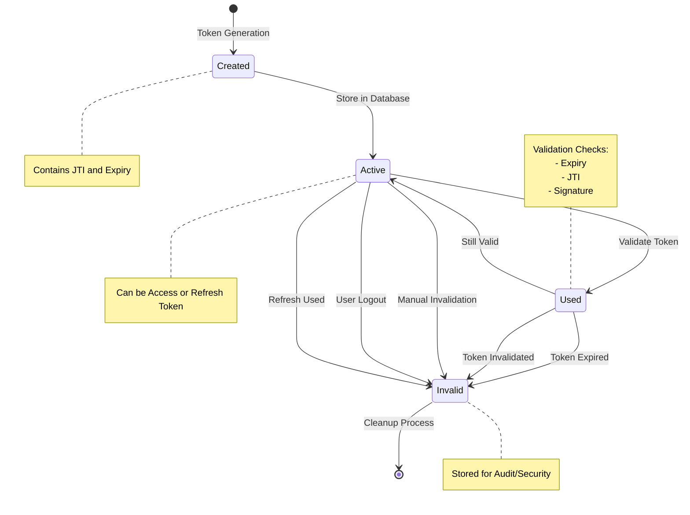

# State Diagram for Token Lifecycle

```mermaid
stateDiagram-v2
    [*] --> Created: Token Generation
    Created --> Active: Store in Database
    Active --> Used: Validate Token
    Used --> Active: Still Valid
    Used --> Invalid: Token Expired
    Used --> Invalid: Token Invalidated
    Active --> Invalid: Manual Invalidation
    Active --> Invalid: User Logout
    Active --> Invalid: Refresh Used
    Invalid --> [*]: Cleanup Process

    note right of Created
        Contains JTI and Expiry
    end note

    note right of Active
        Can be Access or Refresh Token
    end note

    note right of Invalid
        Stored for Audit/Security
    end note

    note left of Used
        Validation Checks:
        - Expiry
        - JTI
        - Signature
    end note
```
