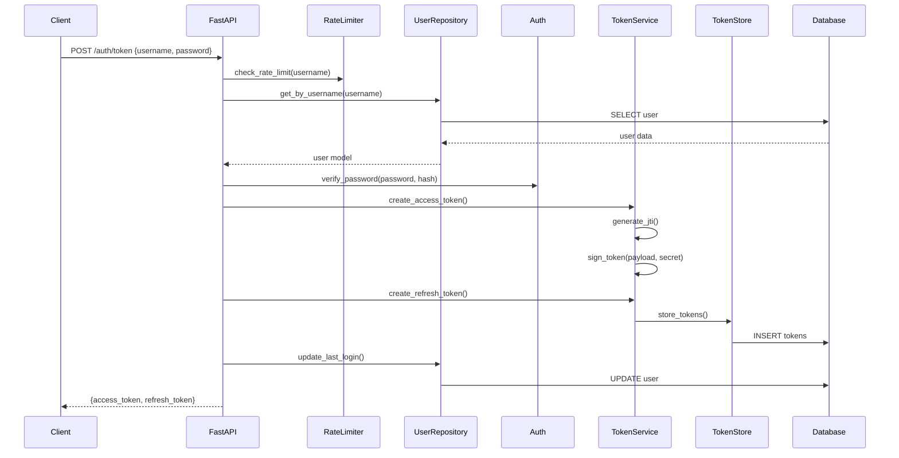

# User Authentication Flow

```mermaid
sequenceDiagram
    participant C as Client
    participant F as FastAPI
    participant R as RateLimiter
    participant U as UserRepository
    participant A as Auth
    participant T as TokenService
    participant S as TokenStore
    participant D as Database

    C->>F: POST /auth/token {username, password}
    F->>R: check_rate_limit(username)
    F->>U: get_by_username(username)
    U->>D: SELECT user
    D-->>U: user data
    U-->>F: user model
    F->>A: verify_password(password, hash)
    F->>T: create_access_token()
    T->>T: generate_jti()
    T->>T: sign_token(payload, secret)
    F->>T: create_refresh_token()
    T->>S: store_tokens()
    S->>D: INSERT tokens
    F->>U: update_last_login()
    U->>D: UPDATE user
    F-->>C: {access_token, refresh_token}
```